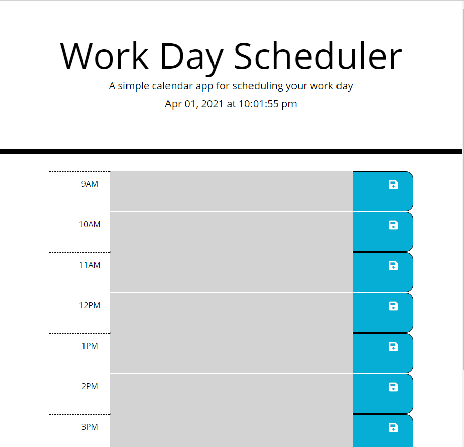
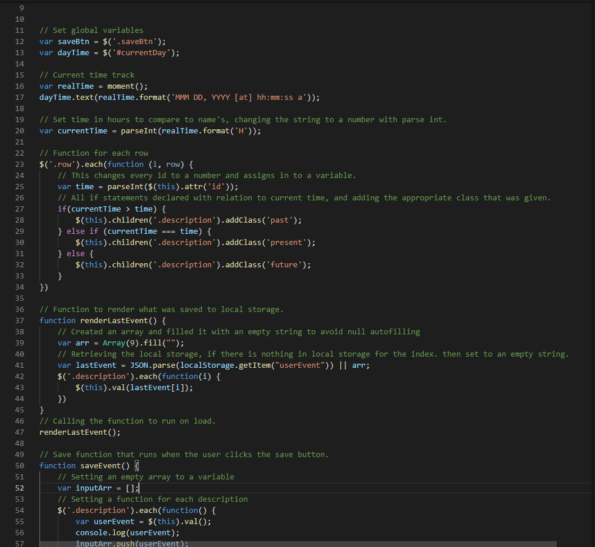

# Day Planner

## In this project I was given a basic set up of HTML and CSS. No Javascript! I was assigned the task of building a day planner that a user could enter in events and save them. Each time slot would need to be color coated so the user could identify if they are in the past, present or future. The user could also refresh the page or bring it up later and the site would still be saved how they left it. I'm happy to say I conquered all of these tasks. With the help of Bootstrap, jQuery and Moment.js I was able to create a day planner that will save all of your activities for the day.

## Technology I Put to Work
- GitHub - repository storage for the project in order to amke changes, deploy them and push to a main branch. 

- GitBash - used for written commands and communicating witht he repository stored on GitHub.

- HTML - used to create and edit electronic documents stored on the web.

- Javascript - a programming language used to create specific events and make your website pop to viewers.
    - Conditional Statements
    - Local Storage
    - Functions

- jQuery - this is simppler way to format Javascript by adding the long text of standard Javascript into smaller jQuery methods.
    - Event Listeners
    - Selectors
    - DOM Manipulation

- Bootstrap - an open-source and free to use front end framework that helps design websites and apps.
    - Grid Selections
    - Rows / Columns

- Moment.js - a Javascript library that helps displaying date/time.

## Site Preview

## How it was made!
``HTML

``Javascript

## The full quiz is deployed here! Click the link to have a look!

[Full-Site](https://dnovelli1.github.io/dayplanner/)

## Links to my other Professional Site's!

[LinkedIn](https://www.linkedin.com/in/david-jacob-novelli/)

[GitHub](https://github.com/dnovelli1)